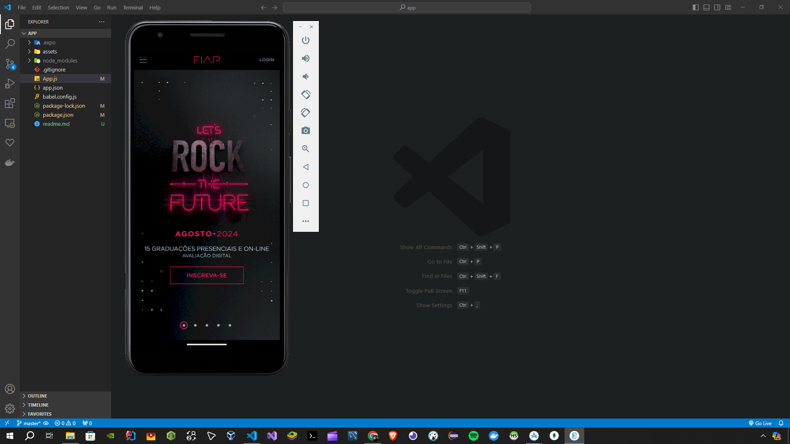

# Projeto Sidebar em React Native

Tive uma conversa com um professor de mobile da minha universidade e perguntei a ele porque não podíamos simplesmente criar um site responsivo e depositá-los dentro de uma webview do react native, assim não só teríamos um app dinâmico mas sim um que fosse independente de upgrades perguntados.

A grande a questão aqui é, se fizermos isso porovavelmente não poderemos mexer com a arquiteura interna do celular, o que dificutaria muito na hora de construir um bom app de celular, mas vez em outra veja bem o que queremos, temos um site de faculdade, realmente precisamos construir o front dele do zero em native ?

A resposta talvez seja não, sempre será necessário fazer alguns ajustes, estilos não são exatos porque variam conforme nossa perspectiva, tenham em mente que este "app" que fiz é apenas um clone de uma página existente, que eventualmente pode bloquear tal tipo de virtualização mas veja bem, é um app e funciona...

## Como Executar

1. Certifique-se de ter o [Android Studio](https://developer.android.com/studio) instalado com um emulador Android em execução.

2. Instale as dependências:

   ```bash
   npm install
   ```

3. Execute o projeto:

   ```bash
   npm run dev
   ```

## Demonstração



## Contribuição

Contribuições são bem-vindas! Sinta-se à vontade para relatar problemas ou enviar pull requests.
